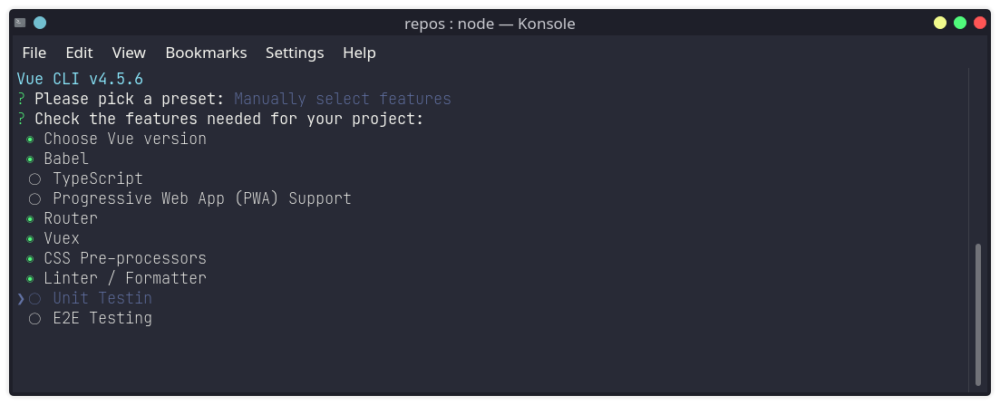
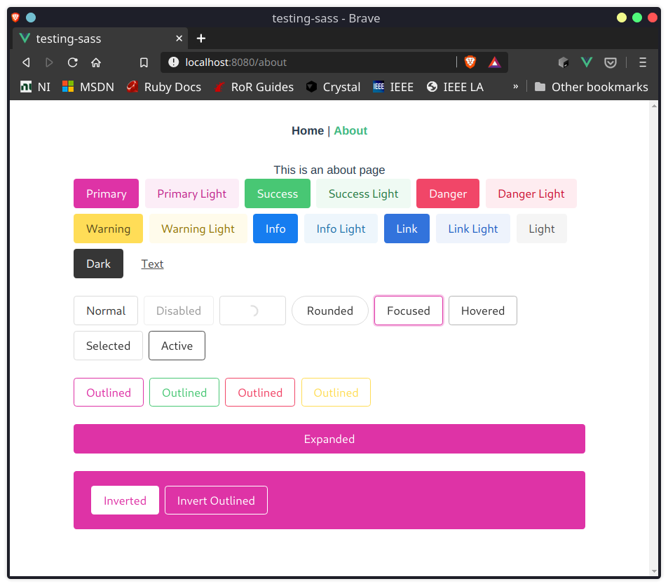

# Configuring Buefy & SASS: VueCLI

This is a 'bare-minimum' setup to use Vue.js with:

- Bulma, via Buefy;
- Sass with scss syntax;
- Globally loaded sass variables.

This solves my journey of trying to use sass variables inside vue components.
The repository itself is a kind of documentation for myself.

_____


1. Create your application via vue-cli:

    ```shell
    vue create yourAppName
    ```
    - I suggest to configure CSS pre-processor during project scaffold.

    <p align="center">
    
    </p>


2. Test your app:

    ```shell
    npm run serve
    ```


3. Install buefy and register it.
    ```shell
    npm install buefy
    ```

- Note that I'm registering everything and globally.
    ```js
    // src/main.js
    import Buefy from "buefy";
    Vue.use(Buefy);
    ```
- Include some Buefy elements and test it.


4. Install sass dependencies, if missing.

    ```shell
    npm install -D node-sass sass-loader sass
    ```


5. create your styles.
- In this example, it's the app.scss file. 
    ```scss
    // src/assets/app.scss

    // Import Bulma's core
    @import "~bulma/sass/utilities/_all";

    // Set your colors
    // ~ Just changing to a arbitrary primary color to demonstrate the usage. You can customize your Bulma/Buefy style HERE!.
    $primary: #DE33A6; 
    $primary-invert: findColorInvert($primary);

    // ~ Note that the above variables were not redefined when following Buefy customization guide, so you end with the light and dark colors that refer to either Bulma or Buefy primary light/dark colors. 
    $primary-light: findLightColor($primary);
    $primary-dark: findDarkColor($primary);

    // Setup $colors to use as bulma classes (e.g. 'is-twitter')

    // ~ I've got this from Bulma variable's documentation. It's a little different from Buefy guide's. 
    $colors: mergeColorMaps((
        "white": ($white, $black), 
        "black": ($black, $white), 
        "light": ($light, $light-invert), 
        "dark": ($dark, $dark-invert), 
        "primary": ($primary, $primary-invert, $primary-light, $primary-dark), 
        "link": ($link, $link-invert, $link-light, $link-dark), 
        "info": ($info, $info-invert, $info-light, $info-dark), 
        "success": ($success, $success-invert, $success-light, $success-dark), 
        "warning": ($warning, $warning-invert, $warning-light, $warning-dark), 
        "danger": ($danger, $danger-invert, $danger-light, $danger-dark)), 
        $custom-colors); 

    // Links
    $link: $primary;
    $link-invert: $primary-invert;
    $link-focus-border: $primary;

    // Import Bulma and Buefy styles
    @import "~bulma";
    @import "~buefy/src/scss/buefy";
    ```


5. Setup sass-loader

- Ok, now we'll configure the vue-cli to use sass-loader. 

    ```js
    // vue.config.js
    const path = require('path');

    module.exports = {
        css: {
        loaderOptions: {
        sass: {
            sassOptions: {
            indentedSyntax: false,
                },
                prependData: '@import "~@/assets/app.scss";',
        },
        },
    },
    assetsDir: '@/assets/',
    }
    ```
6. You may be able to use your variables inside vue components.

    - Here's Buefy buttons, using the modified primary color:
    <p align="center">
    
    </p>

    ```js
    // src/components/HelloWorld.vue

    <template>
    <div class="hello">

        ...

    </div>
    </template>

    <script>
    export default {
    name: "HelloWorld",

        ...

    }
    };
    </script>

    <style scoped lang="scss">

    ... 

    a {
    color: $primary;
    }
    </style>


    ```

 7. Start developing!

_


## Important Links:
For more information, you can check the documentations:
- [Customize Vue CLI configuration](https://cli.vuejs.org/config/).
- [Customize Vue CLI: CSS Loaders](https://cli.vuejs.org/config/#css-loaderoptions)
- [Customize Buefy](https://buefy.org/documentation/customization)
- [Bulma Variables](https://bulma.io/documentation/customize/variables/)
### 